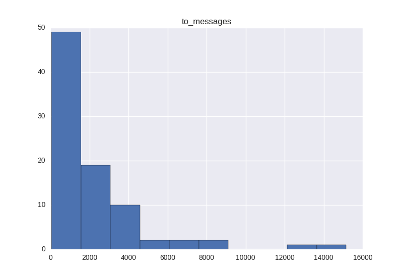
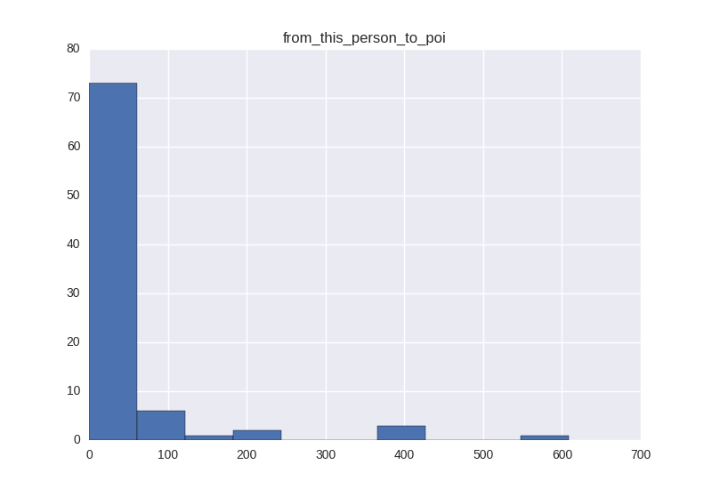
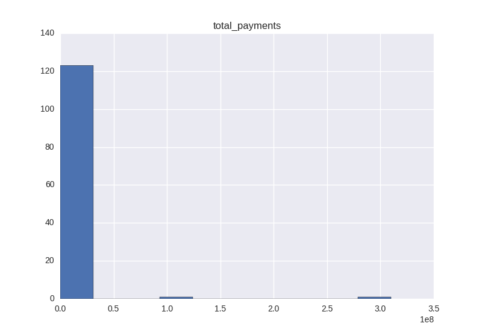
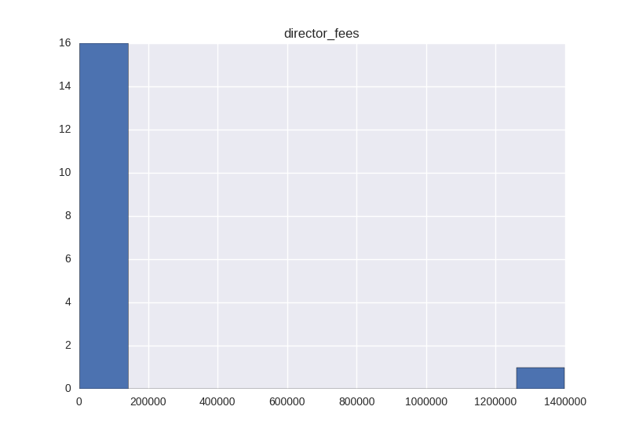
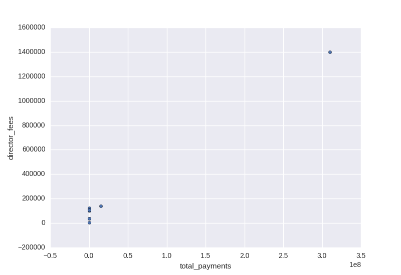

# Udacity-Project5

### 1. Goal of this project

Enron was one of the largest companies in the United States,
By 2002, it had collapsed into bankruptcy due to widespread corporate fraud.
A significant amount of typically confidential information entered into the public record,
we are trying to building a person of interest identifier algorithm,
based on financial and email data made public as a result of the Enron scandal.

### 2. Data Exploration

#### 2.1 total number of data points

There are 140 data points.

#### 2.2 allocation across classes (POI/non-POI)

There 18 POI and 122 non-POI.

#### 2.3 are there features with many missing values

The zero percent is calculated for each feature as below:

| Features      | Zero Percent  |
| ------------- |:-------------:|
| salary        | 34%   |
| deferral_payments| 73%      |
| total_payments | 14%      |
| loan_advances | 97%     |
| bonus | 43%      |
| restricted_stock_deferred |88%     |
| deferred_income | 66%      |
| total_stock_value | 13%     |
| expenses | 34%      |
| exercised_stock_options | 30%     |
| other | 36%      |
| long_term_incentive |54%     |
| restricted_stock | 24%      |
| director_fees | 88%      |
| to_messages | 41%      |
| from_poi_to_this_person |49%     |
| from_messages | 41%     |
| from_this_person_to_poi | 54%     |
| shared_receipt_with_poi | 41%      |

The code below is how I get the number. You may find png files in folder, it's the histogram for all features.

```
## data explore
print len(data)
# 15 zeros
# 50
print 'salary'
print sum(data[:,1] == 0)*1.0/len(data)
# 106
print 'deferral_payments'
print sum(data[:,2] == 0)*1.0/len(data)
# 20
print 'total_payments'
print sum(data[:,3] == 0)*1.0/len(data)
# 141
print 'loan_advances'
print sum(data[:,4] == 0)*1.0/len(data)
# 63
print 'bonus'
print sum(data[:,5] == 0)*1.0/len(data)
# 127
print 'restricted_stock_deferred'
print sum(data[:,6] == 0)*1.0/len(data)
# 96
print 'deferred_income'
print sum(data[:,7] == 0)*1.0/len(data)
# 19
print 'total_stock_value'
print sum(data[:,8] == 0)*1.0/len(data)
# 50
print 'expenses'
print sum(data[:,9] == 0)*1.0/len(data)
# 43
print 'exercised_stock_options'
print sum(data[:,10] == 0)*1.0/len(data)
# 52
print 'other'
print sum(data[:,11] == 0)*1.0/len(data)
# 79
print 'long_term_incentive'
print sum(data[:,12] == 0)*1.0/len(data)
# 35
print 'restricted_stock'
print sum(data[:,13] == 0)*1.0/len(data)
# 128
print 'director_fees'
print sum(data[:,14] == 0)*1.0/len(data)
# 59
print 'to_messages'
print sum(data[:,15] == 0)*1.0/len(data)
# 71
print 'from_poi_to_this_person'
print sum(data[:,16] == 0)*1.0/len(data)
# 59
print 'from_messages'
print sum(data[:,17] == 0)*1.0/len(data)
# 79
print 'from_this_person_to_poi'
print sum(data[:,18] == 0)*1.0/len(data)
# 59
print 'shared_receipt_with_poi'
print sum(data[:,19] == 0)*1.0/len(data)
```

#### 2.4 outlier remove

First I remove all rows which the 4 features(please refer to 3.1 feature selection) are NaN

```
to_delete_idx = []
for k in my_dataset:
    if (my_dataset[k]['to_messages'] == 'NaN') \
    and (my_dataset[k]['from_this_person_to_poi'] == 'NaN') \
    and (my_dataset[k]['total_payments'] == 'NaN') \
    and (my_dataset[k]['director_fees'] == 'NaN'):
        to_delete_idx.append(k)

for k in to_delete_idx:
    del(my_dataset[k])
```

Then I visualize the 4 features I pick, You may see to_messages.png, from_this_person_to_poi.png, total_payments.png, and director_fees.png file below, there is always seem a very big value in histogram.






You can see that there is an outlier here which have very big total payment nd director fees, after find the key of this row, it turns out it's TOATAL! There is doubt that it's an outlier.


My code to visualize feature
```
df['to_messages'].hist()
plt.show()
df['from_this_person_to_poi'].hist()
plt.show()
df['total_payments'].hist()
plt.show()
df['director_fees'].hist()
plt.show()
df.plot.scatter(x='total_payments', y='director_fees')
plt.show()
```
My code to find and delete TOTAL.
```
df = pd.DataFrame.from_dict(data_dict, orient='index', dtype=np.float)
print df['total_payments'].dropna(how=any).idxmax()
max_outlier = df['total_payments'].argmax()
del(my_dataset[max_outlier])
```


### 3. Features and Scaling
#### 3.1 Features Selection
I use SelectKBest to pick features, and select the top 4 features who get higher scores, you may see the pic below.

The code is below.
```
labels = features_list[1:]
selector = SelectKBest(f_classif, k=10)
selector.fit(features_train, labels_train)
data = []
labels = []
# print selector.scores_
top_index = sorted(range(len(selector.scores_)), key=lambda i: selector.scores_[i])[-10:]
for i in top_index:
    labels.append(features_list[i])
    data.append(selector.scores_[i])

fig, ax = plt.subplots()
ind = range(len(labels))
width = 0.2
rects1 = ax.bar(ind, data, width, color='blue')
ax.set_ylabel('Scores')
ax.set_title('Feature Scores')
ax.set_xticks(ind)
ax.set_xticklabels(labels, rotation=45)
plt.tight_layout()
plt.show()
fig.savefig('feature scores.png')
```

#### 3.2 New Feature
When I am tuning algorithm DecisionTree, I create a new feature 'whether_email_to_poi'. I think more emails to poi person
doesn't necessary mean this person is more likely to be a poi, but whether email
to poi is a strong evidence. The person who once emailed to poi, means they have a connection.
But aftet test it with new feature, the precision drops so this is not a good new feature.

```
# Code about new feature
for k1 in my_dataset:
    if my_dataset[k1]['from_this_person_to_poi'] == 'NaN':
        my_dataset[k1]['whether_email_to_poi'] = 0
    else:
        my_dataset[k1]['whether_email_to_poi'] = 1
```

#### 3.3 Scaling

I use the MinMaxScaler for svm, since scaling is critical for svm I use a simple scaler but easy to deploy. It helps a lot to improve my precesion.

### 4. Pick and Tune an Algorithm

I tried SVM and DecisionTreeClassifier, and tune the parameters by GridSearchCV. You may see the code below:

**SVM**
```
tuned_parameters = {
                       'clf__C': [1e-5, 1e-4, 1e-3, 1e-2, 1e-1, 1, 10, 1e2, 1e5],
                       'clf__gamma': [0.0, 0.1, 0.2, 0.3],
                       'clf__kernel': ['rbf', 'poly'],
                       'clf__tol': [1e-1, 1e-2, 1e-4, 1e-5],
                       'clf__class_weight': [{True: 12, False: 1},
                                               {True: 4, False: 1},
                                               {True: 1, False: 1},
                                                ]
                      }

pipe = Pipeline([('reduce_dim', SelectKBest(f_classif, k=4)),
                ('min/max scaler', MinMaxScaler(feature_range=(0.0, 1.0))),
                ('clf', SVC())])
# pipe = Pipeline([('reduce_dim', SelectKBest(f_classif, k=4)), ('clf', SVC())])
cv = StratifiedShuffleSplit(labels, n_iter = 10, test_size=0.2, random_state = 42)
a_grid_search = GridSearchCV(pipe, param_grid=tuned_parameters, cv=cv, scoring='precision')
a_grid_search.fit(features, labels)
print a_grid_search.best_score_
```
**DecisionTree**
```
 tuned_parameters = {'clf__max_depth': [2, 3, 4, 5, 6, 7, 8, 9, 10],
                     'clf__min_samples_split': [2, 3, 4, 5, 6, 7, 8, 9, 10],
                     'clf__min_samples_leaf': [2, 3, 4, 5, 6, 7, 8, 9, 10]
                     }
pipe = Pipeline([('reduce_dim', SelectKBest(f_classif, k=4)),
                ('min/max scaler', MinMaxScaler(feature_range=(0.0, 1.0))),
                ('clf', tree.DecisionTreeClassifier)])
cv = StratifiedShuffleSplit(labels, n_iter = 10, test_size=0.2, random_state = 42)
a_grid_search = GridSearchCV(pipe, param_grid=tuned_parameters, cv=cv, scoring='precision')
a_grid_search.fit(features, labels)
print a_grid_search.best_score_
```

### 5. Validation and Performance
#### 5.1 Metrics
Precesion
> proportion of POI and those who are incorrectly identified as poi

Recall
> proportion of POI and those who are incorrectly identified as non-poi


#### 5.2 Validation

Learning the parameters of a prediction function and testing it on the same data is a methodological mistake: a model that would just repeat the labels of the samples that it has just seen would have a perfect score but would fail to predict anything useful on yet-unseen data. This situation is called overfitting. So we need to split our dataset into 2 parts, training data to train our algorithm, and test data to validate performance.

#### 5.3 Results

Testing by test.py
> Accuracy: 0.81713 Precision: 0.33423  Recall: 0.37450 F1: 0.35322 F2: 0.36569
  Total predictions: 15000  True positives:  749  False positives: 1492 False negatives: 1251 True negatives: 11508


