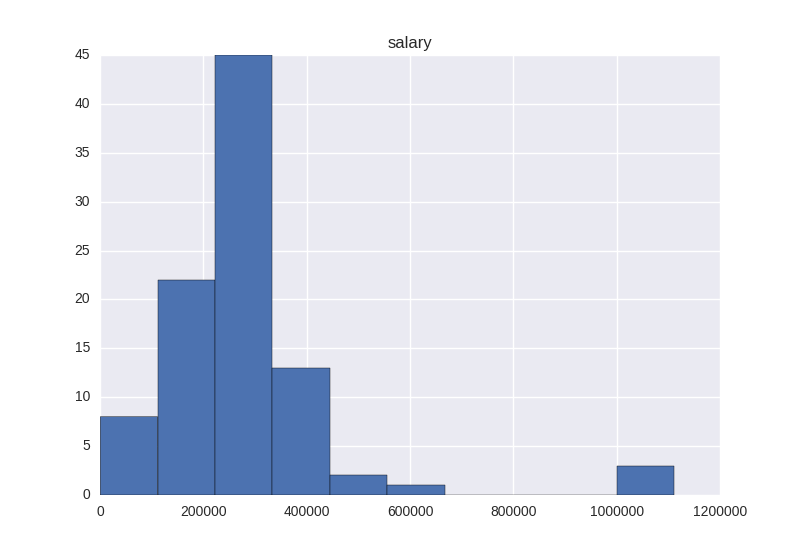
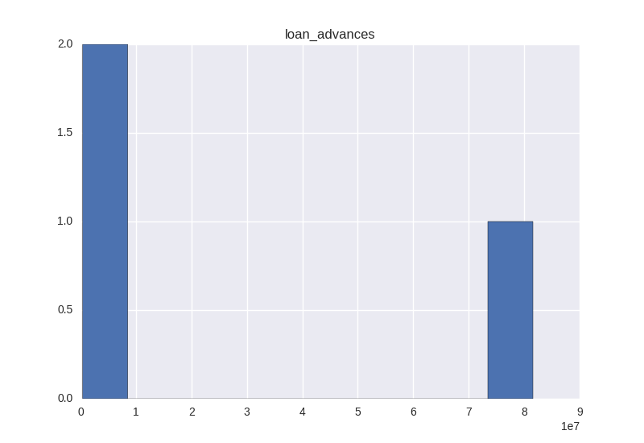

# Udacity-Project5

### 1. Introduction

Enron was one of the largest companies in the United States, By 2002, it had collapsed into bankruptcy due to widespread corporate fraud. A significant amount of typically confidential information entered into the public record, we are trying to building a person of interest identifier algorithm, based on financial and email data made public as a result of the Enron scandal.I am going to use [svm](http://scikit-learn.sourceforge.net/stable/modules/generated/sklearn.svm.SVC.html#sklearn.svm.SVC) algorithm, the precision and recall is  0.45773 and  0.3005.

### 2. Data Exploration

#### 2.1 total number of data points

There are 113 data points.

#### 2.2 allocation across classes (POI/non-POI)

There 18 POI and 95 non-POI.

#### 2.3 features with many missing values

The zero percent is calculated for each feature as below:

| Features      | Zero Percent  |
| ------------- |:-------------:|
| salary        | 34%   |
| deferral_payments| 73%      |
| total_payments | 14%      |
| loan_advances | 97%     |
| bonus | 43%      |
| restricted_stock_deferred |88%     |
| deferred_income | 66%      |
| total_stock_value | 13%     |
| expenses | 34%      |
| exercised_stock_options | 30%     |
| other | 36%      |
| long_term_incentive |54%     |
| restricted_stock | 24%      |
| director_fees | 88%      |
| to_messages | 41%      |
| from_poi_to_this_person |49%     |
| from_messages | 41%     |
| from_this_person_to_poi | 54%     |
| shared_receipt_with_poi | 41%      |

The code below is how I get the number. You may find png files in Pic folder, it's the histogram for all features.

```
## data explore
print len(data)
# 15 zeros
# 50
print 'salary'
print sum(data[:,1] == 0)*1.0/len(data)
# 106
print 'deferral_payments'
print sum(data[:,2] == 0)*1.0/len(data)
# 20
print 'total_payments'
print sum(data[:,3] == 0)*1.0/len(data)
# 141
print 'loan_advances'
print sum(data[:,4] == 0)*1.0/len(data)
# 63
print 'bonus'
print sum(data[:,5] == 0)*1.0/len(data)
# 127
print 'restricted_stock_deferred'
print sum(data[:,6] == 0)*1.0/len(data)
# 96
print 'deferred_income'
print sum(data[:,7] == 0)*1.0/len(data)
# 19
print 'total_stock_value'
print sum(data[:,8] == 0)*1.0/len(data)
# 50
print 'expenses'
print sum(data[:,9] == 0)*1.0/len(data)
# 43
print 'exercised_stock_options'
print sum(data[:,10] == 0)*1.0/len(data)
# 52
print 'other'
print sum(data[:,11] == 0)*1.0/len(data)
# 79
print 'long_term_incentive'
print sum(data[:,12] == 0)*1.0/len(data)
# 35
print 'restricted_stock'
print sum(data[:,13] == 0)*1.0/len(data)
# 128
print 'director_fees'
print sum(data[:,14] == 0)*1.0/len(data)
# 59
print 'to_messages'
print sum(data[:,15] == 0)*1.0/len(data)
# 71
print 'from_poi_to_this_person'
print sum(data[:,16] == 0)*1.0/len(data)
# 59
print 'from_messages'
print sum(data[:,17] == 0)*1.0/len(data)
# 79
print 'from_this_person_to_poi'
print sum(data[:,18] == 0)*1.0/len(data)
# 59
print 'shared_receipt_with_poi'
print sum(data[:,19] == 0)*1.0/len(data)
```

### 3. Outlier Remove

First I remove all rows which the 4 features(please refer to 4.1 feature selection) are NaN

```
to_delete_idx = []
for k in my_dataset:
    if (my_dataset[k]['to_messages'] == 'NaN') \
    and (my_dataset[k]['from_this_person_to_poi'] == 'NaN') \
    and (my_dataset[k]['total_payments'] == 'NaN') \
    and (my_dataset[k]['director_fees'] == 'NaN'):
        to_delete_idx.append(k)

for k in to_delete_idx:
    del(my_dataset[k])
```

Then I visualize the 4 features I pick, you can see that there is an outlier here which have a very big value, it turns out to be TOTAL!


After delete TOTAL row, then visualize the 4 features again, it seems quite normal now.





My code to visualize feature
```
df = pd.DataFrame.from_dict(data_dict, orient='index', dtype=np.float)
df['salary'].hist()
plt.title('salary')
plt.show()
df['loan_advances'].hist()
plt.title('loan_advances')
plt.show()
df['deferred_income'].hist()
plt.title('deferred_income')
plt.show()
df['expenses'].hist()
plt.title('expenses')
plt.show()
df.plot.scatter(x='salary', y='expenses' )
plt.show()
```
My code to find and delete TOTAL.
```
df = pd.DataFrame.from_dict(data_dict, orient='index', dtype=np.float)
print df['total_payments'].dropna(how=any).idxmax()
total_outlier = 'TOTAL'
del(my_dataset[total_outlier])
df = df.drop([total_outlier])
```


### 4. Features and Scaling
#### 4.1 Features Selection
I use SelectKBest to pick features, and select the top 4 features who get higher scores, you may see the pic below. They are
dalary, loan_advances, deferred_income and expenses.

The code is below.
```
labels = features_list[1:]
selector = SelectKBest(f_classif, k=10)
selector.fit(features_train, labels_train)
data = []
labels = []
# print selector.scores_
top_index = sorted(range(len(selector.scores_)), key=lambda i: selector.scores_[i])[-10:]
for i in top_index:
    labels.append(features_list[i])
    data.append(selector.scores_[i])

fig, ax = plt.subplots()
ind = range(len(labels))
width = 0.2
rects1 = ax.bar(ind, data, width, color='blue')
ax.set_ylabel('Scores')
ax.set_title('Feature Scores')
ax.set_xticks(ind)
ax.set_xticklabels(labels, rotation=45)
plt.tight_layout()
plt.show()
fig.savefig('feature scores.png')
```

#### 4.2 New Feature
When I am tuning algorithm DecisionTree, I create a new feature 'whether_email_to_poi'. I think more emails to poi person
doesn't necessary mean this person is more likely to be a poi, but whether email
to poi is a strong evidence. The person who once emailed to poi, means they have a connection.
But aftet test it with new feature, the precision drops so this is not a good new feature.

```
# Code about new feature
for k1 in my_dataset:
    if my_dataset[k1]['from_this_person_to_poi'] == 'NaN':
        my_dataset[k1]['whether_email_to_poi'] = 0
    else:
        my_dataset[k1]['whether_email_to_poi'] = 1
```

#### 4.3 Scaling

I use the MinMaxScaler for svm, since scaling is critical for svm I use a simple scaler but easy to deploy. It helps a lot to improve my precesion.

### 5. Pick and Tune an Algorithm
#### 5.1 why we need tuning parameters
The parameters can have a huge impact on performance, sometimes different parameters means trade-off between different metric, so we have to banlance and find the best setting. Even it's time consuming, it worths it.

#### 5.2  parameter tuning process
I tried SVM and DecisionTreeClassifier, and tune the parameters by GridSearchCV. You may see the code below:

**SVM**
```
tuned_parameters = {
                       'clf__C': [0.5, 0.75, 1.5],
                       'clf__gamma': [0.0, 0.1, 0.2],
                       'clf__kernel': ['rbf'],
                       'clf__tol': [1e-1, 1e-2, 1e-4, 1e-5],
                       'clf__class_weight': ['auto']
                      }

pipe = Pipeline([('min/max scaler', MinMaxScaler(feature_range=(0.0, 1.0))),
                ('clf', SVC())])
# scoring_parameters = 'precision,recall'
cv = StratifiedShuffleSplit(labels, n_iter = 20, test_size=0.2, random_state = 42)
a_grid_search = GridSearchCV(pipe, param_grid=tuned_parameters, scoring='precision', cv=cv, n_jobs=8)
a_grid_search.fit(features, labels)
clf = a_grid_search.best_estimator_
```
**DecisionTree**
```
 tuned_parameters = {'clf__max_depth': [2, 3, 4, 5, 6, 7, 8, 9, 10],
                     'clf__min_samples_split': [2, 3, 4, 5, 6, 7, 8, 9, 10],
                     'clf__min_samples_leaf': [2, 3, 4, 5, 6, 7, 8, 9, 10]
                     }
pipe = Pipeline([('clf', tree.DecisionTreeClassifier())])
cv = StratifiedShuffleSplit(labels, n_iter = 10, test_size=0.2, random_state = 42)
a_grid_search = GridSearchCV(pipe, param_grid=tuned_parameters, cv=cv, scoring='precision')
a_grid_search.fit(features, labels)
clf = a_grid_search.best_estimator_
print a_grid_search.best_score_
```

### 6. Validation and Performance
#### 6.1 metrics
Precesion
> How precise the algorithm are

Recall
> Ability to find all poi, how complete the results are

In order to find all poi, sometimes we label some non-poi as poi, the reverse is true. So we have to balance between precesion and recall, can't judge the performance of algorithm by one simple metric.

#### 6.2 why validation

Learning the parameters of a prediction function and testing it on the same data is a methodological mistake: a model that would just repeat the labels of the samples that it has just seen would have a perfect score but would fail to predict anything useful on yet-unseen data. This situation is called overfitting. So we need to split our dataset into 2 parts, training data to train our algorithm, and test data to validate performance.

#### 6.3 cross validation type

There are many cross validation methods to choose, since our dataset is a highly unbanlanced dataset, very few true poi, it's not suitiable for K-fold. StratifiedShuffleSplit is a merge of StratifiedKFold and ShuffleSplit, which returns stratified randomized folds. The folds are made by preserving the percentage of samples for each class, it's suitable for our dataset.

#### 6.4 results
Testing by test.py

| Metrics      | Value|
| ------------- |:-------------:|
| Precision        | 0.45773   |
| Recall        | 0.30050   |


